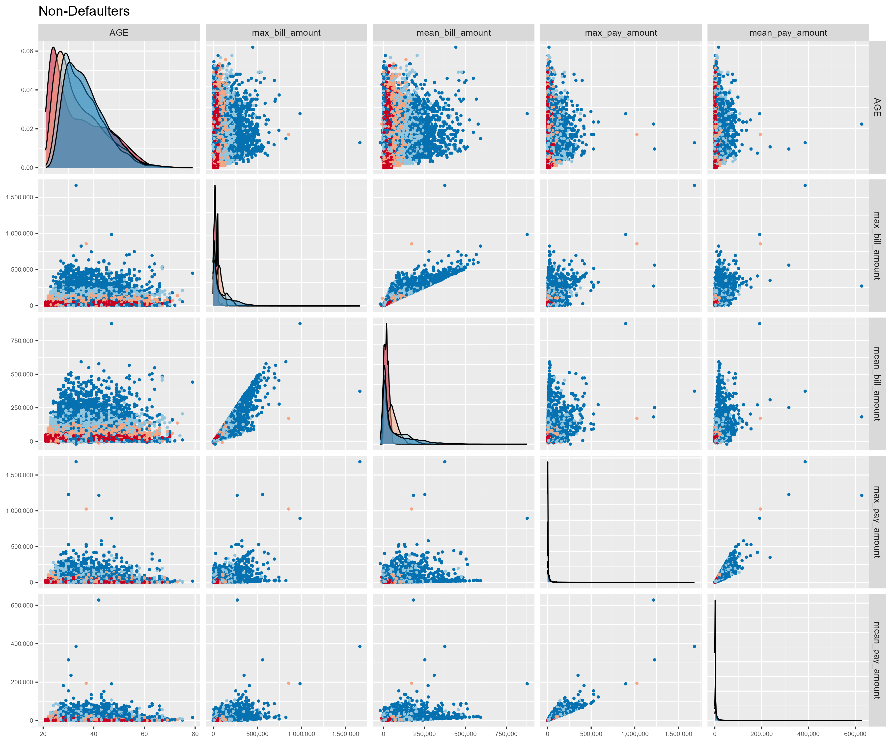
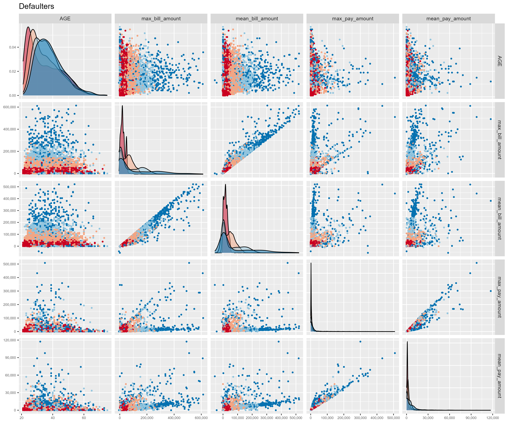
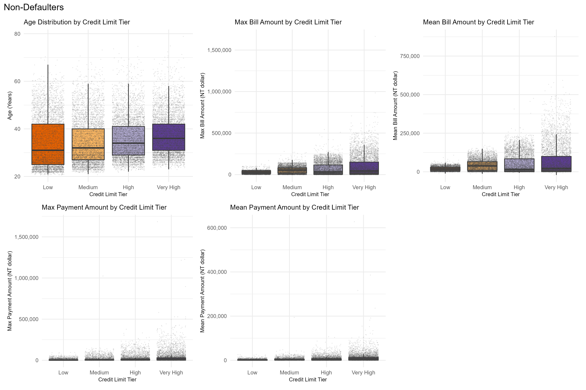
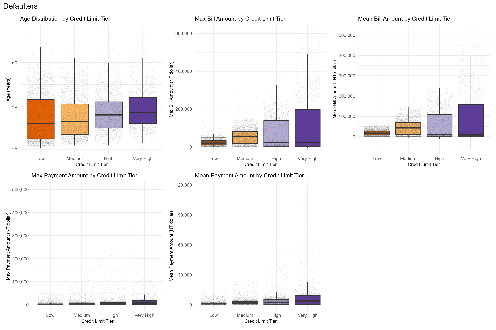
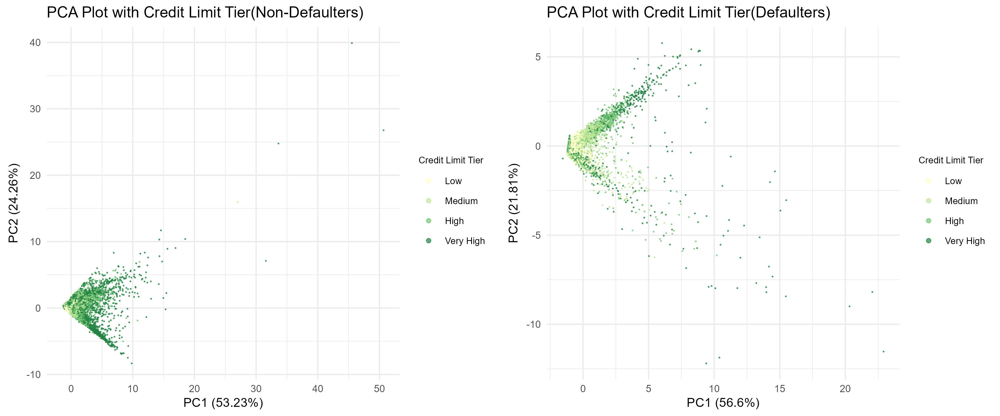
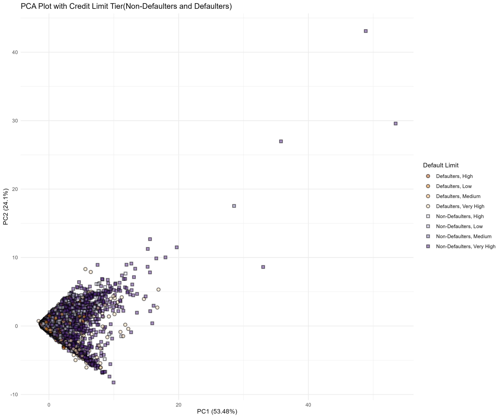
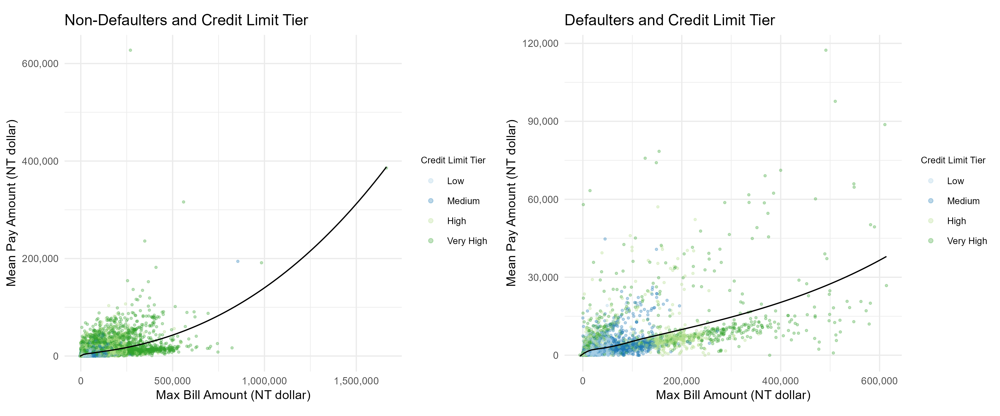

## **Description of the dataset**

URL: <https://archive.ics.uci.edu/dataset/350/default+of+credit+card+clients>

The original paper: Yeh, I., & Lien, C. (2009). The comparisons of data mining techniques for the predictive accuracy of probability of default of credit card clients. Expert Syst. Appl., 36, 2473-2480.

[https://doi.org/](https://doi.org/10.1016/j.dss.2009.05.016){.uri}[10.1016/J.ESWA.2007.12.020](https://doi.org/10.1016/J.ESWA.2007.12.020)

### **Background**

This dataset examines customer default payments in Taiwan and comprises 24 variables, 30,000 records, including 23 independent variables and one binary response variable indicating default payment status (1 for default, 0 for no default). The independent variables capture demographic information such as credit amount, gender, education, marital status, and age, alongside monthly repayment status from April to September 2005. The repayment status is measured on a scale where -1 indicates timely payment, and values from 1 to 9 reflect increasing durations of payment delays, with 9 signifying a delay of nine months or more. Additionally, the dataset includes monthly bill statement amounts and amounts paid during the same period. The data was collected from credit reports and payment histories, facilitating a comprehensive analysis of factors influencing default risk.

### **License**

Distributed under CC BY 4.0
https://creativecommons.org/licenses/by/4.0/

The CC BY 4.0 license allows anyone to copy, redistribute the material for any purpose, even commercially, and remix, transform, and build upon the material for any purpose, but we must give appropriate credit.Users cannot impose restrictions that limit others' rights under this license.

# **Exploratory data visualization**

### **Preparation**

```{r}

#Load necessary libraries for data manipulation, visualization, and reporting
library(tidyverse); packageVersion("tidyverse") 
library(patchwork); packageVersion("patchwork") 
library(cowplot); packageVersion("cowplot") 
library(scales); packageVersion("scales") 
library(GGally); packageVersion("GGally") 
library(knitr); packageVersion("knitr") 
library(ggplot2); packageVersion("ggplot2") 
library(plotly); packageVersion("plotly")
library(htmlwidgets); packageVersion("htmlwidgets")
library(htmltools); packageVersion("htmltools")

```

```{r}
#I save the default of credit card clients.xls as default_of_credit_card_clients.csv

#Load dataset and clean it by removing the first column and row, and resetting row names
d1 <- read.csv("default_of_credit_card_clients.csv")
d1 <- d1[, -1]  
colnames(d1) <- as.character(d1[1, ]) 
d1 <- d1[-1, ] 
rownames(d1) <- NULL  

#Check for null values in the dataset (no missing values)
null_counts <- sapply(d1, function(col) sum(is.na(col)))
# Print the count of null values for each column
# print(null_counts)
```

```{r}
# Convert categorical variables to factors
d1$SEX <- as.factor(d1$SEX)
d1$EDUCATION <- as.factor(d1$EDUCATION)
d1$MARRIAGE <- as.factor(d1$MARRIAGE)
d1$PAY_0 <- as.factor(d1$PAY_0)
d1$PAY_2 <- as.factor(d1$PAY_2)
d1$PAY_3 <- as.factor(d1$PAY_3)
d1$PAY_4 <- as.factor(d1$PAY_4)
d1$PAY_5 <- as.factor(d1$PAY_5)
d1$PAY_6 <- as.factor(d1$PAY_6)
d1$`default payment next month` <- as.factor(d1$`default payment next month`)

# Convert relevant columns to numeric
d1$LIMIT_BAL <- as.numeric(d1$LIMIT_BAL)
d1$AGE <- as.numeric(d1$AGE)
d1$BILL_AMT1 <- as.numeric(d1$BILL_AMT1)
d1$BILL_AMT2 <- as.numeric(d1$BILL_AMT2)
d1$BILL_AMT3 <- as.numeric(d1$BILL_AMT3)
d1$BILL_AMT4 <- as.numeric(d1$BILL_AMT4)
d1$BILL_AMT5 <- as.numeric(d1$BILL_AMT5)
d1$BILL_AMT6 <- as.numeric(d1$BILL_AMT6)
d1$PAY_AMT1 <- as.numeric(d1$PAY_AMT1)
d1$PAY_AMT2 <- as.numeric(d1$PAY_AMT2)
d1$PAY_AMT3 <- as.numeric(d1$PAY_AMT3)
d1$PAY_AMT4 <- as.numeric(d1$PAY_AMT4)
d1$PAY_AMT5 <- as.numeric(d1$PAY_AMT5)
d1$PAY_AMT6 <- as.numeric(d1$PAY_AMT6)

# Create breaks for LIMIT_BAL
breaks <- quantile(d1$LIMIT_BAL, probs = seq(0, 1, by = 0.25), na.rm = TRUE)

# Categorize LIMIT_BAL into discrete levels based on quantiles
d1$LIMIT_BAL_Discrete <- cut(d1$LIMIT_BAL, breaks = breaks, include.lowest = TRUE, labels = c("Low", "Medium", "High", "Very High"))

# Convert LIMIT_BAL_Discrete to factor
d1$LIMIT_BAL_Discrete <- as.factor(d1$LIMIT_BAL_Discrete)

# Remove LIMIT_BAL from the dataset
d1 <- d1 %>% select(-LIMIT_BAL)

# Calculate max and mean for BILL_AMT1 to BILL_AMT6
max_bill_amount <- apply(d1[, c("BILL_AMT1", "BILL_AMT2", "BILL_AMT3", "BILL_AMT4", "BILL_AMT5", "BILL_AMT6")], 1, max, na.rm = TRUE)
mean_bill_amount <- rowMeans(d1[, c("BILL_AMT1", "BILL_AMT2", "BILL_AMT3", "BILL_AMT4", "BILL_AMT5", "BILL_AMT6")], na.rm = TRUE)

# Add max and mean to the dataset
d1$max_bill_amount <- as.numeric(max_bill_amount)
d1$mean_bill_amount <- as.numeric(mean_bill_amount)

# Calculate totals and means for PAY_AMT1 to PAY_AMT6
max_pay_amount <- apply(d1[, c("PAY_AMT1", "PAY_AMT2", "PAY_AMT3", "PAY_AMT4", "PAY_AMT5", "PAY_AMT6")], 1, max, na.rm = TRUE)
mean_pay_amount <- rowMeans(d1[, c("PAY_AMT1", "PAY_AMT2", "PAY_AMT3", "PAY_AMT4", "PAY_AMT5", "PAY_AMT6")], na.rm = TRUE)

# Add max and mean to the dataset
d1$max_pay_amount <- as.numeric(max_pay_amount)
d1$mean_pay_amount <- as.numeric(mean_pay_amount)

# Remove BILL_AMT1 to BILL_AMT6 and PAY_AMT1 to PAY_AMT6 from the dataset
d1 <- d1 %>% select(-BILL_AMT1, -BILL_AMT2, -BILL_AMT3, -BILL_AMT4, -BILL_AMT5, -BILL_AMT6)
d1 <- d1 %>% select(-PAY_AMT1, -PAY_AMT2, -PAY_AMT3, -PAY_AMT4, -PAY_AMT5, -PAY_AMT6)

# Recode the default payment status variable to "Yes" for default (1) and "No" for no default (0)
d1$`default payment next month` <- ifelse(d1$`default payment next month` == 1, "Yes", "No")

# Create datasets for default payment status
dataset_a <- d1 %>% filter(`default payment next month` == "No")
dataset_b <- d1 %>% filter(`default payment next month` == "Yes")

# Check the number of rows in each dataset
cat("Number of rows in dataset_a (default payment next month = 0):", nrow(dataset_a), "\n")
cat("Number of rows in dataset_b (default payment next month = 1):", nrow(dataset_b), "\n")

```

### **Scatter plot using GGally**

```{r}
# Select relevant columns for analysis from the dataset of non-defaulters
selected_columns_a <- dataset_a %>% select(AGE, max_bill_amount, mean_bill_amount, max_pay_amount, mean_pay_amount, LIMIT_BAL_Discrete)

# Define custom colors for the plot
custom_colors <- c("#ca0020", "#f4a582", "#92c5de", "#0571b0") 

#Create a pairs plot (ggpairs) for the selected numeric columns, colored by LIMIT_BAL_Discret
gg_a<-ggpairs(selected_columns_a, 
    columns = 1:5,  # Specify only the numeric columns
    mapping = aes(color = LIMIT_BAL_Discrete), 
    upper = list(continuous = wrap("points", size = 0.8)), 
    lower = list(continuous = wrap("points", size = 0.8)), 
    diag = list(continuous = wrap("densityDiag", alpha = 0.5))) +
    labs(color = "Credit Limit Tier",title = "Non-Defaulters") +
    scale_color_manual(values = custom_colors) +  
    scale_fill_manual(values = custom_colors) + 
    theme(axis.text.x = element_text(size = 6), axis.text.y = element_text(size = 6)) +scale_x_continuous(labels = label_comma()) + 
    scale_y_continuous(labels = label_comma())


ggsave("gg_a.png", plot = gg_a, width = 12, height = 10, dpi = 300)

```

Figure 1 \| Scatter plots and density plots for Non-Defaulters to identify potentially interesting patterns. This visualization is color-blind friendly.

```{r}
# Select relevant columns for analysis from the dataset of defaulters
selected_columns_b <- dataset_b %>% select(AGE, max_bill_amount, mean_bill_amount, max_pay_amount, mean_pay_amount, LIMIT_BAL_Discrete)

#Create a pairs plot (ggpairs) for the selected numeric columns, colored by LIMIT_BAL_Discret
gg_b<-ggpairs(selected_columns_b, 
        columns = 1:5,  # Specify only the numeric columns
        mapping = aes(color = LIMIT_BAL_Discrete), 
        upper = list(continuous = wrap("points", size = 0.8)), 
        lower = list(continuous = wrap("points", size = 0.8)), 
        diag = list(continuous = wrap("densityDiag", alpha = 0.5))) +
  labs(color = "Credit Limit Tier",title = "Defaulters") +
  scale_color_manual(values = custom_colors) +  # Apply custom colors
  scale_fill_manual(values = custom_colors) +  # Apply custom colors to density fill
  theme(axis.text.x = element_text(size = 6), 
        axis.text.y = element_text(size = 6)) +
  scale_x_continuous(labels = label_comma()) + 
  scale_y_continuous(labels = label_comma())
ggsave("gg_b.png", plot = gg_b, width = 12, height = 10, dpi = 300)


```

Figure 2 \| Scatter plots and density plots for Defaulters to identify potentially interesting patterns. This visualization is color-blind friendly.

### **Boxplot + Jitter plot**

```{r}
#Function to create a box plot with jitter for a specified variable
create_box_plot <- function(data, y_var, title, y_label) {
  ggplot(data, aes(x = LIMIT_BAL_Discrete, y = !!sym(y_var), 
                   fill =  LIMIT_BAL_Discrete)) +
    scale_fill_manual(values = c("#e66101", '#fdb863', '#b2abd2', '#5e3c99')) +
    geom_boxplot(outliers = FALSE, width = 0.8) +
    geom_jitter(size = 0.01, width = 0.4, alpha = 0.1, color = "gray27") +  
    labs(title = title, x = "Credit Limit Tier", y = y_label) +
    scale_y_continuous(labels = label_comma()) +
    theme_minimal() +
    theme(legend.position = "none",plot.title = element_text(size = 10),  
      axis.title.x = element_text(size = 8),              
      axis.title.y = element_text(size = 8),            
      axis.text = element_text(size = 8)
    )
}

# Create a list of box plots for different variables
plot_list <- list(
  create_box_plot(selected_columns_a, "AGE", "Age Distribution by Credit Limit Tier", "Age (Years)"),
  create_box_plot(selected_columns_a, "max_bill_amount", "Max Bill Amount by Credit Limit Tier", "Max Bill Amount (NT dollar)"),
  create_box_plot(selected_columns_a, "mean_bill_amount", "Mean Bill Amount by Credit Limit Tier", "Mean Bill Amount (NT dollar)"),
  create_box_plot(selected_columns_a, "max_pay_amount", "Max Payment Amount by Credit Limit Tier", "Max Payment Amount (NT dollar)"),
  create_box_plot(selected_columns_a, "mean_pay_amount", "Mean Payment Amount by Credit Limit Tier", "Mean Payment Amount (NT dollar)")
)

# Combine all individual plots into a single plot layout with 3 columns
combined_plot_a <- plot_grid(plotlist = plot_list, ncol = 3)+plot_annotation(title = "Non-Defaulters")

# Save the combined plot as a PNG file with specified dimensions and resolution
ggsave("combined_plot_a.png", plot = combined_plot_a, width = 12, height = 8, dpi = 300)

# Display the saved combined plot in the report

```

Figure 3 \| Box Plot + Jitter Plot for Non-Defaulters to visualize the relationship between the Credit Limit Tier and some continuous factors.This visualization is color-blind friendly.

```{r}

# Create a list of box plots for different variables
plot_list <- list(
  create_box_plot(selected_columns_b, "AGE", "Age Distribution by Credit Limit Tier", "Age (Years)"),
  create_box_plot(selected_columns_b, "max_bill_amount", "Max Bill Amount by Credit Limit Tier", "Max Bill Amount (NT dollar)"),
  create_box_plot(selected_columns_b, "mean_bill_amount", "Mean Bill Amount by Credit Limit Tier", "Mean Bill Amount (NT dollar)"),
  create_box_plot(selected_columns_b, "max_pay_amount", "Max Payment Amount by Credit Limit Tier", "Max Payment Amount (NT dollar)"),
  create_box_plot(selected_columns_b, "mean_pay_amount", "Mean Payment Amount by Credit Limit Tier", "Mean Payment Amount (NT dollar)")
)

# Combine all individual plots into a single plot layout with 3 columns
combined_plot_b <- plot_grid(plotlist = plot_list, ncol = 3)+plot_annotation(title = "Defaulters")

# Save the combined plot as a PNG file with specified dimensions and resolution
ggsave("combined_plot_b.png", plot = combined_plot_b, width = 12, height = 8, dpi = 300)

# Display the saved combined plot in the report

```

Figure 4 \| Box Plot + Jitter Plot for Defaulters to visualize the relationship between the Credit Limit Tier and some continuous factors.This visualization is color-blind friendly.

### **Dimension reduction**

#### **Analyzing Non-Defaulters and Defaulters separately**

```{r}

# Perform Principal Component Analysis (PCA) on selected numeric columns, excluding LIMIT_BAL_Discrete
pca_result_a <- selected_columns_a%>% select(-LIMIT_BAL_Discrete) %>%prcomp(center = TRUE, scale = TRUE)

# Create a data frame containing the PCA results (principal component scores)
pca_data_a <- as.data.frame(pca_result_a$x)

# Add the LIMIT_BAL_Discrete variable to the PCA results for grouping
pca_data_a$LIMIT_BAL_Discrete <- dataset_a$LIMIT_BAL_Discrete

#Calculate the proportion of variance explained by each principal component
pca_vars_a <- pca_result_a$sdev^2
prop_vars_a <- pca_vars_a / sum(pca_vars_a)

# Create a scatter plot of the first two principal components, colored by credit limit tier
pca_plot_a <- ggplot(pca_data_a, aes(x = PC1, y = PC2, 
                                     color = LIMIT_BAL_Discrete)) +
  geom_point(alpha = 0.7,size=0.1) +  
  labs(title = "PCA Plot with Credit Limit Tier(Non-Defaulters)",
       x = paste("PC1 (", round(prop_vars_a[1] * 100, 2), "%)", sep = ""),
       y = paste("PC2 (", round(prop_vars_a[2] * 100, 2), "%)", sep = ""),
       color = "Credit Limit Tier") +
  scale_color_manual(values = c("#ffffcc", '#c2e699', '#78c679', '#238443')) +  
  theme_minimal() +
  theme(legend.position = "right", legend.text = element_text(size = 8),  
    legend.title = element_text(size = 8),aspect.ratio = 1)+ 
  guides(color = guide_legend(override.aes = list(size = 1.5)))  


# Print the PCA plot (commented out, can be uncommented to display)
#print(pca_plot_a)

```

```{r}

# Extract loading scores from the PCA result to understand variable contributions
loading_scores_a <- pca_result_a$rotation

# Convert loading scores to a data frame for easier interpretation
loading_scores_dfa <- as.data.frame(loading_scores_a)

# Display the loading scores to assess the contribution of each variable to the principal components (commented out, can be uncommented to display)
# print(loading_scores_dfa)
```

```{r}

# Perform Principal Component Analysis (PCA) on selected numeric columns, excluding LIMIT_BAL_Discrete
pca_result_b <- selected_columns_b%>% select(-LIMIT_BAL_Discrete) %>%prcomp(center = TRUE, scale = TRUE)

# Create a data frame containing the PCA results (principal component scores)
pca_data_b <- as.data.frame(pca_result_b$x)

# Add the LIMIT_BAL_Discrete variable to the PCA results for grouping
pca_data_b$LIMIT_BAL_Discrete <- dataset_b$LIMIT_BAL_Discrete

#Calculate the proportion of variance explained by each principal component
pca_vars_b <- pca_result_b$sdev^2
prop_vars_b <- pca_vars_b/ sum(pca_vars_b)

# Create a scatter plot of the first two principal components
pca_plot_b <- ggplot(pca_data_b, aes(x = PC1, y = PC2, 
                                     color = LIMIT_BAL_Discrete)) +
  geom_point(alpha = 0.7,size=0.1) +  # Adjust transparency for better visibility
  labs(title = "PCA Plot with Credit Limit Tier(Defaulters)",
      x = paste("PC1 (", round(prop_vars_b[1] * 100, 2), "%)", sep = ""),
       y = paste("PC2 (", round(prop_vars_b[2] * 100, 2), "%)", sep = ""),
       color = "Credit Limit Tier") +
  scale_color_manual(values = c("#ffffcc", '#c2e699', '#78c679', '#238443')) +  
  theme_minimal() +
  theme(legend.position = "right", legend.text = element_text(size = 8),  
    legend.title = element_text(size = 8),aspect.ratio = 1)+  
  guides(color = guide_legend(override.aes = list(size = 1.5))) 


# Print the PCA plot (commented out, can be uncommented to display)
#print(pca_plot_b)
```

```{r}

# Extract loading scores from the PCA result to understand variable contributions
loading_scores_b <- pca_result_b$rotation

# Convert loading scores to a data frame for easier interpretation
loading_scores_dfb <- as.data.frame(loading_scores_b)

# Display the loading scores to assess the contribution of each variable to the principal components (commented out, can be uncommented to display)
# print(loading_scores_dfb)
```

```{r}
# Combine two PCA plots (pca_plot_a and pca_plot_b) into a single layout with 2 columns
combined_pca <- plot_grid(pca_plot_a,pca_plot_b, ncol = 2)

# Save the combined PCA plot as a PNG file with specified dimensions and resolution
ggsave("combined_pca.png", plot = combined_pca, width = 12, height = 5, dpi = 300)

# Display the saved combined PCA plot in the report

```

Figure 5 \| PCA plot for continuous features and the Credit Limit Tier of Non-Defaulters and Defaulters.This visualization is color-blind friendly.

#### **Analyzing Non-Defaulters and Defaulters together**

```{r}

# Select relevant columns for PCA analysis, including age, bill amounts, payment amounts, credit limit tier, and default status
selected_columns_all <- d1 %>% select(AGE, max_bill_amount, mean_bill_amount, max_pay_amount, mean_pay_amount, LIMIT_BAL_Discrete, `default payment next month`)

# Perform PCA on the selected numeric columns, excluding LIMIT_BAL_Discrete and default payment status
pca_result_all <- selected_columns_all %>% select(-c(LIMIT_BAL_Discrete, `default payment next month`)) %>% prcomp(center = TRUE, scale = TRUE)

# Create a data frame with PCA results (principal component scores)
pca_data_all <- as.data.frame(pca_result_all$x)

# Add LIMIT_BAL_Discrete and default payment status to the PCA results for grouping
pca_data_all$LIMIT_BAL_Discrete <- d1$LIMIT_BAL_Discrete
pca_data_all$`default payment next month` <- d1$`default payment next month`

# Calculate the proportion of variance explained by each principal component
pca_vars_all <- pca_result_all$sdev^2
prop_vars_all <- pca_vars_all / sum(pca_vars_all)

# Create a new variable combining default payment status and credit limit tier
pca_data_all <- pca_data_all %>%
  mutate(default_limit = case_when(
    `default payment next month` == "Yes" & LIMIT_BAL_Discrete == "Low" ~ "Defaulters, Low",
    `default payment next month` == "Yes" & LIMIT_BAL_Discrete == "Medium" ~ "Defaulters, Medium",
    `default payment next month` == "Yes" & LIMIT_BAL_Discrete == "High" ~ "Defaulters, High",
    `default payment next month` == "Yes" & LIMIT_BAL_Discrete == "Very High" ~ "Defaulters, Very High",
    `default payment next month` == "No" & LIMIT_BAL_Discrete == "Low" ~ "Non-Defaulters, Low",
    `default payment next month` == "No" & LIMIT_BAL_Discrete == "Medium" ~ "Non-Defaulters, Medium",
    `default payment next month` == "No" & LIMIT_BAL_Discrete == "High" ~ "Non-Defaulters, High",
    `default payment next month` == "No" & LIMIT_BAL_Discrete == "Very High" ~ "Non-Defaulters, Very High"
  ))

# Create a scatter plot of the first two principal components, colored and shaped by the new variable
pca_plot_all <- ggplot(pca_data_all, aes(x = PC1, y = PC2, fill = default_limit, color = default_limit, shape = default_limit)) +
  geom_point(alpha = 0.5, size = 2, stroke = 1) + 
  labs(title = "PCA Plot with Credit Limit Tier(Non-Defaulters and Defaulters)",
       x = paste("PC1 (", round(prop_vars_all[1] * 100, 2), "%)", sep = ""),
       y = paste("PC2 (", round(prop_vars_all[2] * 100, 2), "%)", sep = ""),
       fill = "Default Limit",
       color = "Default Limit",
       shape = "Default Limit") +
  scale_fill_manual(values = c("#b35806", '#e08214', '#fdb863', '#fee0b6', 
                                '#d8daeb', '#b2abd2', '#8073ac', '#542788')) +  
  scale_color_manual(values = rep("black", 8)) +  
  scale_shape_manual(values = c(21, 21, 21, 21, 22, 22, 22, 22)) +
  theme_minimal() +
  theme(legend.position = "right")

# Save the PCA plot as a PNG file with specified dimensions and resolution
ggsave("pca_plot_all.png", plot = pca_plot_all, width = 12, height = 10, dpi = 300)

# Display the saved PCA plot in the report

```

Figure 6 \| PCA plot for continuous features and the Credit Limit Tier of Non-Defaulters and Defaulters in a single figure.

```{r}

# Extract loading scores from the PCA result to understand variable contributions
loading_scores_all <- pca_result_all$rotation

# Convert loading scores to a data frame for easier interpretation
loading_scores_dfall <- as.data.frame(loading_scores_all)

# Display the loading scores to assess the contribution of each variable to the principal components (commented out, can be uncommented to display)
# print(loading_scores_dfall)
```

### **For explanatory data visualization**

In the PCA analysis, I found that PC1 of the Non-Defaulters and PC1 of the Defaulters data explain Credit Limit Tier. Scatter plots, sine plots, Loading scores from the PCA indicate that Max Bill Amount and Mean Pay Amount play important roles in determining the Credit Limit Tier of both Non-Defaulters and Defaulters. Therefore, I will focus on visualizing these two variables in the explanatory data visualization.


## **Explanatory data visualization**

### **Static figures**

```{r}

#Create a scatter plot of max bill amount vs. mean pay amount for non-defaulters, colored by credit limit tier
scatter_plot_a <- ggplot(dataset_a, aes(x = max_bill_amount, y = mean_pay_amount, color = LIMIT_BAL_Discrete)) +
  geom_point(alpha = 0.3, size = 0.7) +
  geom_smooth(method = "loess", se = FALSE,span=0.7, size=0.5, color = "black") +  
  labs(title = "Non-Defaulters and Credit Limit Tier",
       x = "Max Bill Amount (NT dollar)",
       y = "Mean Pay Amount (NT dollar)",
       color = "Credit Limit Tier") +
  scale_x_continuous(labels = label_comma()) +
  scale_y_continuous(labels = label_comma()) +
  scale_color_manual(values = c("Low" = "#a6cee3", 
                                 "Medium" = "#1f78b4", 
                                 "High" = "#b2df8a", 
                                 "Very High" = "#33a02c")) +  
    theme_minimal() +
  theme(legend.position = "right", legend.text = element_text(size = 8),  
    legend.title = element_text(size = 8),aspect.ratio = 1)+  
  guides(color = guide_legend(override.aes = list(size = 1.5)))


# Print the scatter plot (commented out, can be uncommented to display)
# print(scatter_plot_a)
```

```{r}

#Create a scatter plot of max bill amount vs. mean pay amount for non-defaulters, colored by credit limit tier
scatter_plot_b <- ggplot(dataset_b, aes(x = max_bill_amount, y = mean_pay_amount, color = LIMIT_BAL_Discrete)) +
  geom_point(alpha = 0.3, size = 0.7) + 
  geom_smooth(method = "loess", se = FALSE,span=0.7, size=0.5, color = "black") +  
  labs(title = "Defaulters and Credit Limit Tier",
       x = "Max Bill Amount (NT dollar)",
       y = "Mean Pay Amount (NT dollar)",
       color = "Credit Limit Tier") +
  scale_x_continuous(labels = label_comma()) +
  scale_y_continuous(labels = label_comma()) +
  scale_color_manual(values = c("Low" = "#a6cee3", 
                                 "Medium" = "#1f78b4", 
                                 "High" = "#b2df8a", 
                                 "Very High" = "#33a02c")) + 
  theme_minimal() +
  theme(legend.position = "right", legend.text = element_text(size = 8),  
    legend.title = element_text(size = 8),aspect.ratio = 1)+ 
  guides(color = guide_legend(override.aes = list(size = 1.5)))  

# Print the scatter plot (commented out, can be uncommented to display)
# print(scatter_plot_b)
```

```{r}
# Combine two scatter plots (scatter_plot_a and scatter_plot_b) into a single layout with 2 columns
scatter_plot_a_b <- plot_grid(scatter_plot_a,scatter_plot_b, ncol = 2)

# Save the combined scatter plot as a PNG file with specified dimensions and resolution
ggsave("scatter_plot_a_b.png", plot = scatter_plot_a_b, width = 12, height = 5, dpi = 300)

# Display the saved combined scatter plot in the report

```

Figure 7 \| Explanatory data visualization of the relationship among Mean Pay Amount, Mean Bill Amount, and Credit Limit Tier. The color gradient represents the Credit Limit Tier, while the black line indicates the LOWESS smoothing curve. Each point influences the curve based on a window of 70% of the data points, striking a balance between capturing trends and local variations. This visualization is designed to be color-blind friendly.

## **Explanatory data visualization using interactive plots or animations**

### **Creating plotly figures**

```{r}

#Define color palettes for points and LOWESS curves
point_colors <- c("#fdae61", "#abd9e9") 
curve_colors <- c("#d7191c", "#2c7bb6") 

# Prepare the data by creating a new variable for default payment status and credit limit tier
d1 <- d1 %>%
  mutate(default_limit = case_when(
    `default payment next month` == "Yes" & LIMIT_BAL_Discrete == "Low" ~ "Defaulters, Low",
    `default payment next month` == "Yes" & LIMIT_BAL_Discrete == "Medium" ~ "Defaulters, Medium",
    `default payment next month` == "Yes" & LIMIT_BAL_Discrete == "High" ~ "Defaulters, High",
    `default payment next month` == "Yes" & LIMIT_BAL_Discrete == "Very High" ~ "Defaulters, Very High",
    `default payment next month` == "No" & LIMIT_BAL_Discrete == "Low" ~ "Non-Defaulters, Low",
    `default payment next month` == "No" & LIMIT_BAL_Discrete == "Medium" ~ "Non-Defaulters, Medium",
    `default payment next month` == "No" & LIMIT_BAL_Discrete == "High" ~ "Non-Defaulters, High",
    `default payment next month` == "No" & LIMIT_BAL_Discrete == "Very High" ~ "Non-Defaulters, Very High"
  ))
```

```{r, fig.width=9, fig.height=6}

# Prepare hover text
d1 <- d1 %>%
  mutate(hover_text = paste("Max Bill Amount:", scales::comma(max_bill_amount), "<br>",
                             "Mean Pay Amount:", scales::comma(mean_pay_amount), "<br>",
                             "Default Limit:", default_limit))

# Create scatter plot with tooltips
scatter_plot_all <- ggplot(d1, aes(x = max_bill_amount, y = mean_pay_amount, fill = default_limit, color = default_limit, shape = default_limit, text = hover_text)) +
  geom_point(alpha = 0.8, size = 1.5, stroke = 0.2, show.legend = FALSE) +  

  # LOWESS curve for Defaulters
  geom_smooth(data = d1 %>% filter(`default payment next month` == "Yes"), 
              method = "loess", se = FALSE, span = 0.7, 
              size = 0.5, color = curve_colors[1], aes(group = 1, linetype = "Defaulters")) + 

  # LOWESS curve for Non-Defaulters
  geom_smooth(data = d1 %>% filter(`default payment next month` == "No"), 
              method = "loess", se = FALSE, span = 0.7, 
              size = 0.5, color = curve_colors[2], aes(group = 1, linetype = "Non-Defaulters")) + 

  labs(title = "Plotly Figure for Non-Defaulters and Defaulters",
       x = "Max Bill Amount (NT dollar)",
       y = "Mean Pay Amount (NT dollar)",
       color = "Default Payment & Credit Limit Tier",
       fill = "Default Payment & Credit Limit Tier",
       shape = "Default Payment & Credit Limit Tier",
       linetype = "LOWESS Curve") + 

  scale_x_continuous(labels = label_comma()) +
  scale_y_continuous(labels = label_comma()) +
  scale_fill_manual(values = rep(point_colors, each = 4)) + 
  scale_color_manual(values = rep("black", 8)) + 
  scale_shape_manual(values = c(21, 22, 23, 25, 21, 22, 23, 25)) +  
  scale_linetype_manual(values = c("Defaulters" = "solid", "Non-Defaulters" = "dashed")) +

  theme_minimal() +
  theme(legend.position = "right", 
        legend.text = element_text(size = 8), 
        legend.title = element_text(size = 8)) +  
  guides(color = guide_legend(override.aes = list(size = 1.5, linetype = NA)), 
         fill = guide_legend(override.aes = list(size = 1.5, linetype = NA)), 
         shape = guide_legend(override.aes = list(size = 1.5)), 
         linetype = guide_legend(override.aes = list(size = 1.5)))

# Convert to interactive plot with tooltips
scatter_plot_all_interactive <- ggplotly(scatter_plot_all, tooltip = "text") %>%
  layout(hoverlabel = list(bgcolor = "white", font = list(color = "black")))

# Display the interactive plot
scatter_plot_all_interactive
```

Figure 8 \| Plotly figure illustrating the relationship between Mean Pay Amount and Max Bill Amount, categorized by Default Payment Status (indicated by color) and Credit Limit Tier (indicated by shape). The red curve represents the LOWESS smoothing curve for Defaulters, while the blue dotted curve represents the LOWESS smoothing curve for Non-Defaulters. Note: Please disregard the "1, NA" entries in the legend, as they are not meaningful.

### **Enhancing Data Insights Through Interactive vs. Static Visualizations**
    
The interactive figure I created represents all the Non-Defaulters and Defaulters . Plotting them in a single static figure can lead to overplotting issues, but an interactive figure can circumvent this problem, as readers can interactively show or hide the data they are interested in. I changed the colors from the static figure to better represent Non-Defaulters and Defaulters. Additionally, I modified the symbols to more effectively differentiate between the different Credit Limit Tier.


## **Discussion**

      
In the scatter plots of Figures 1 and 2, data points within the same Credit Limit Tier display similar distributions, emphasizing its significance in data analysis. Figures 7 and 8 show that individuals with a higher Max Bill Amount and Mean Pay Amount are likely to have a higher Credit Limit Tier. In Figure 8, individuals classified as High or Very High Credit Limit Tier and Non-Defaulters have significantly higher Mean Pay Amount and Max Bill Amount compared to Defaulters. Furthermore, those with lower Mean Pay Amount are more likely to be Defaulters.


<br> <br> <br> <br> <br>
